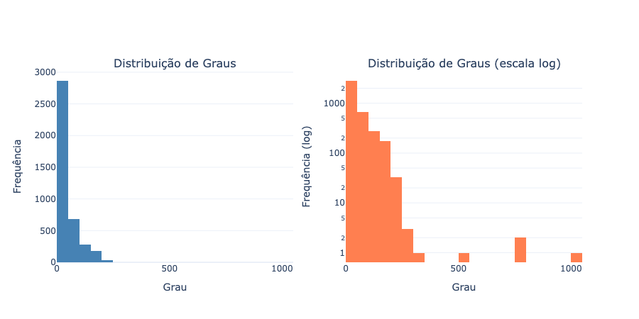
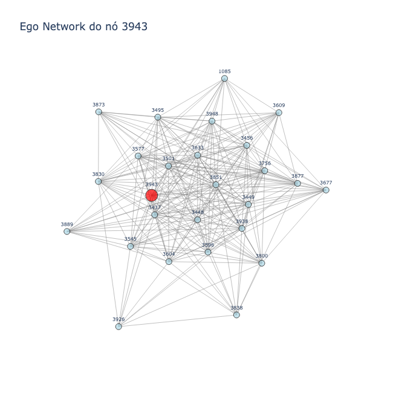

# Relatório Semanal de Atividades

Universidade de Fortaleza 
Programa de Pós-Graduação em Informática Aplicada (PPGIA) 
Laboratório de Ciência de Dados e Inteligência Artificial (LCDIA)

Aluna: Gabriela Ferreira Coutinho 
Orientador: Prof. Rilder de Sousa Pires

## Introdução

Conceitualmente, a definição do que a rede representa é a base da teoria dos grafos:

> Para começar do começo, uma rede — também chamada de grafo na literatura matemática — é, como dissemos, uma coleção de nós (ou vértices) unidos por arestas. (NEWMAN, 2018, p. 105, tradução nossa).

No contexto do presente dataset (ego-Facebook), o significado desses componentes é diretamente ligado à sociologia: "Nós e arestas são também chamados de sítios e ligações na física, e atores e laços na sociologia" (NEWMAN, 2018, p. 106, tradução nossa).

Na sua forma mais simples, uma rede é uma coleção de pontos unidos em pares por linhas. Na terminologia sociológica (frequentemente usada para redes sociais), os nós ou vértices representam as pessoas (frequentemente chamadas de atores) e as arestas representam as conexões sociais (chamadas de laços).

## Sobre o Facebook

O Facebook é tipicamente modelado como uma rede não direcionada, pois a amizade na plataforma exige confirmação mútua, ou seja, é uma relação intrinsecamente simétrica onde a aresta não possui uma direção específica de um nó para o outro. 

Em sua representação matemática fundamental, essa estrutura é traduzida para uma **matriz de adjacência** simétrica:

$$
A_{ij} = \begin{cases} 1, & \text{se existe aresta entre } i \text{ e } j \\ 0, & \text{caso contrário} \end{cases}
$$

Como a rede é não direcionada, a matriz é simétrica: $A_{ij} = A_{ji}$.

## Grau, Densidade e Distribuição de Graus

O grau de um nó $i$ é "o número de arestas conectadas a ele" (NEWMAN, 2018, tradução nossa), representando a quantidade de amigos de um indivíduo:

$$
k_i = \sum_{j=1}^{n} A_{ij}
$$

O **grau médio** $\langle k \rangle$ da rede é dado por:

$$
\langle k \rangle = \frac{2m}{n}
$$

onde $n$ é o número de nós e $m$ é o número de arestas. A **densidade** mede a fração de arestas existentes em relação ao máximo possível:

$$
\rho = \frac{2m}{n(n-1)}
$$

A análise da distribuição de graus revela como essa popularidade está dispersa.

O gráfico linear (à esquerda) exibe uma assimetria extrema à direita, demonstrando que a grande maioria dos usuários possui poucas conexões. O gráfico em escala logarítmica (à direita) evidencia a existência de uma "cauda longa", sugerindo uma aproximação a uma lei de potência (*power law*). Newman fundamenta este achado e a escolha metodológica do gráfico:

> "Redes com distribuições de grau em lei de potência são às vezes chamadas de redes livres de escala (*scale-free networks*). [...] A estratégia mais simples é olhar para um histograma da distribuição de graus em um gráfico log-log [...] para ver se ele segue uma linha reta." (NEWMAN, 2018, tradução nossa).

## Subgrafo Pequeno

O dataset original possui milhares de nós, o que gera um grave problema de poluição visual (*hairball*) se plotado integralmente. Para contornar isso e extrair valor analítico, a imagem `grapho.png` foca exclusivamente na vizinhança de um único nó central, a "Ego Network do nó 3943". Sobre a importância desta etapa, o autor destaca:

> "Um primeiro passo na análise da estrutura de uma rede é muitas vezes fazer uma imagem dela. [...] A visualização pode ser uma ferramenta extraordinariamente útil na análise de dados de redes, permitindo ver instantaneamente características estruturais importantes que, de outra forma, seriam difíceis de extrair dos dados brutos." (NEWMAN, 2018, tradução nossa).

Ao isolar o "ego" (em vermelho) e seus contatos diretos (em azul claro), obtemos um panorama claro e organizado das interações locais.

## Observações

A análise visual do `grapho.png` comprova empiricamente a presença de alta coesão estrutural e transitividade. Nota-se que os vizinhos do nó 3943 estão intensamente conectados entre si, formando dezenas de triângulos de amizade fechados. Esse é um fenômeno clássico em redes sociais do mundo real, governado pelo **coeficiente de aglomeração** (*clustering coefficient*), que Newman descreve perfeitamente:

> "Em muitas redes, particularmente nas redes sociais, o fato de $u$ conhecer $v$ e $v$ conhecer $w$ não garante que $u$ conheça $w$, mas torna isso muito mais provável. O amigo do meu amigo não é necessariamente meu amigo, mas é muito mais provável que seja meu amigo do que um membro da população escolhido aleatoriamente." (NEWMAN, 2018, tradução nossa).

Assim, a rede Ego-Facebook se prova não como um conjunto aleatório de ligações, mas como uma **rede livre de escala** dotada de forte estrutura de comunidades locais e transitividade.

## Referências

NEWMAN, M. E. J. Networks. 2. ed. Oxford: Oxford University Press, 2018.
